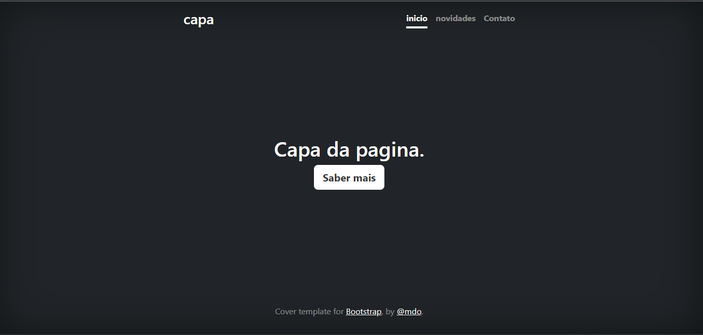

# Índice
   - [Projeto - Aprendendo a escrever um README](#projeto---aprendendo-a-escrever-um-readme)  
   - [Descrição](#descri%C3%A7%C3%A3o)  
   - [Introdução](#introdu%C3%A7%C3%A3o)  
   - [Funcionalidades](#funcionalidades)  
   - [Tecnologias Utilizadas](#tecnologias-utilizadas)  
   - [Fontes Consultadas](#fontes-consultadas)  
   - [Autores](#autores)  

# Projeto - Aprendendo a escrever um README

   
## Descrição 
Esta é a página inicial do meu projeto de um portfólio pessoal.

## Introdução 
O objetivo deste site é criar um portfólio pessoal.

## Funcionalidades
- Ser a página inicial de um site

### Tecnologias Utilizadas
- Utilizei a ferramenta Bootstrap para exemplos de páginas em HTML e CSS.

## Fontes Consultadas
[Get Bootstrap](https://getbootstrap.com/)

## Autores
Leonardo de Oliveira
